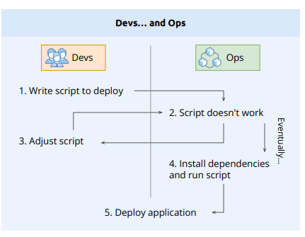
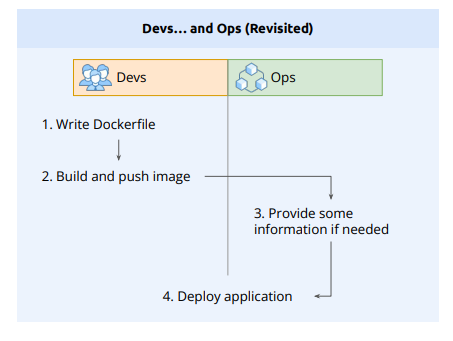
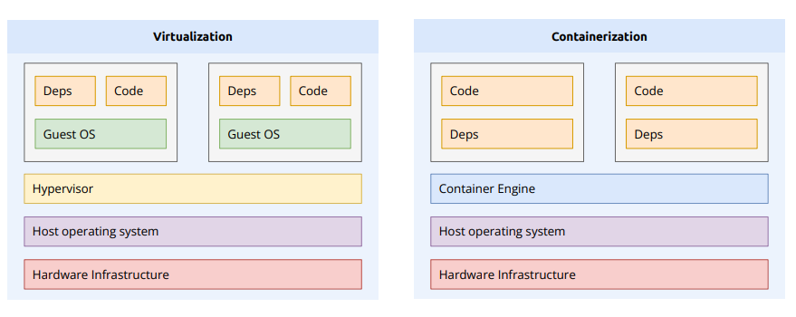
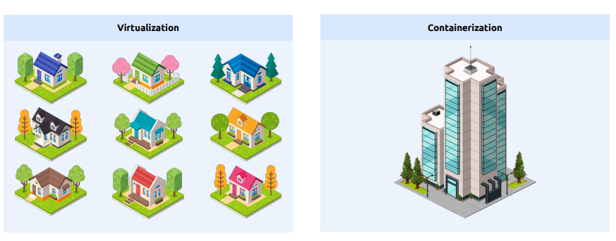
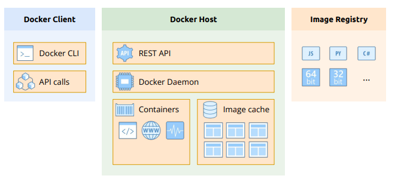
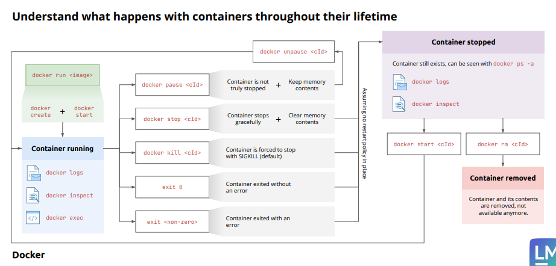
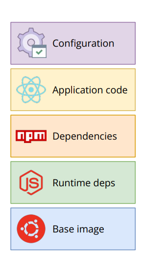

- [Introduction to Containers](#introduction-to-containers)
  - [What are Container](#what-are-container)
    - [In the old days](#in-the-old-days)
    - [But these days](#but-these-days)
      - [One of the first approaches was to use **virtual machines (VMs)**.](#one-of-the-first-approaches-was-to-use-virtual-machines-vms)
      - [The second approaches is a software packaging mechanism is the **Docker container**](#the-second-approaches-is-a-software-packaging-mechanism-is-the-docker-container)
  - [Docker products](#docker-products)
    - [Docker Desktop](#docker-desktop)
    - [Docker Hub](#docker-hub)
    - [Docker Enterprise Edition](#docker-enterprise-edition)
  - [Containers vs Virtual Machines](#containers-vs-virtual-machines)
  - [Docker components](#docker-components)
    - [Docker Architecture Overview](#docker-architecture-overview)
      - [The Docker Client](#the-docker-client)
      - [B. The Docker Host](#b-the-docker-host)
      - [C. Image Registry (Container Registry)](#c-image-registry-container-registry)
    - [Common Workflows](#common-workflows)
      - [Scenario 1: Running a Container (`docker run`) from an image](#scenario-1-running-a-container-docker-run-from-an-image)
      - [Scenario 2: Building and Pushing (`docker build` \& `push`)](#scenario-2-building-and-pushing-docker-build--push)
    - [Key Concepts to Remember](#key-concepts-to-remember)
    - [Summary Table: Local vs. Remote](#summary-table-local-vs-remote)
- [Mastering Containers](#mastering-containers)
  - [Running the container](#running-the-container)
    - [Create and run a new container from an image](#create-and-run-a-new-container-from-an-image)
      - [Example](#example)
    - [List containers](#list-containers)
      - [Example](#example-1)
    - [Fetch the logs of a container](#fetch-the-logs-of-a-container)
    - [Execute a command in a running container](#execute-a-command-in-a-running-container)
    - [Attaching to a running container](#attaching-to-a-running-container)
    - [Pause all processes within one or more containers](#pause-all-processes-within-one-or-more-containers)
    - [Unpause all processes within one or more containers](#unpause-all-processes-within-one-or-more-containers)
    - [Stop one or more running containers](#stop-one-or-more-running-containers)
    - [Remove one or more containers](#remove-one-or-more-containers)
  - [Container Lifecycle](#container-lifecycle)
- [Managing Container Images](#managing-container-images)
  - [What are images?](#what-are-images)
    - [Example of a modified container to create an image](#example-of-a-modified-container-to-create-an-image)
    - [The Layered Structure of an Image](#the-layered-structure-of-an-image)
    - [Sourcing and Distribution](#sourcing-and-distribution)
    - [Understanding Image Tags \& Variants](#understanding-image-tags--variants)
  - [Container Registries](#container-registries)
  - [Docker image CLI](#docker-image-cli)
    - [Download an image from a registry](#download-an-image-from-a-registry)
    - [List images](#list-images)
    - [Remove one or more images](#remove-one-or-more-images)
    - [The Build, Tag, and Push Workflow](#the-build-tag-and-push-workflow)
  - [Repository Management](#repository-management)
  - [Dockerfile](#dockerfile)
    - [Key Benefits of Using Dockerfiles](#key-benefits-of-using-dockerfiles)
    - [Hands-on: Creating first Dockerfile for Nginx](#hands-on-creating-first-dockerfile-for-nginx)
    - [Copying local files into our image](#copying-local-files-into-our-image)
    - [Hands-on: Creating Express.js in Docker](#hands-on-creating-expressjs-in-docker)
      - [First, initialize the project](#first-initialize-the-project)
      - [After initializing the project](#after-initializing-the-project)
- [Other](#other)
  - [Docker Cleanup Commands Reference](#docker-cleanup-commands-reference)
    - [💡 Best Practices for Windows Developers](#-best-practices-for-windows-developers)

# Introduction to Containers

## What are Container

### In the old days

- Developers would develop new applications. Once an application was completed in their eyes, they would hand that application over to the operations engineers, who were then supposed to install it on the production servers and get it running. If the operations engineers were lucky, they even got a somewhat accurate document with installation instructions from the developers
- Usually, each application has some external dependencies, such as which framework it was built on, what libraries it uses, and so on. Sometimes, two applications use the same framework but of different versions that might or might not be compatible with each other



### But these days

#### One of the first approaches was to use **virtual machines (VMs)**.

- Instead of running multiple applications all on the same server, companies would package and run a single application on each VM
- Unfortunately, that happiness didn’t last long. VMs are pretty heavy beasts on their own since they all contain a full-blown operating system such as Linux or Windows Server, and all that for just a single application

#### The second approaches is a software packaging mechanism is the **Docker container**

- Developers package their applications, frameworks, and libraries into Docker containers, and then they ship those containers to the testers or operations engineers
- The engineers know that if any container runs on their servers, then any other containers should run too
- Docker then coined the phrase Build, ship, and run anywhere



## Docker products

### Docker Desktop

- Docker Desktop (along with Docker Toolbox) is a developer-focused application designed for building, debugging, and testing containerized apps on macOS, Windows, and Linux.

- Key Takeaways
  - Target Audience: Primarily built for developers.

  - Functionality: Provides a complete development environment for the entire lifecycle (build, debug, and test) of dockerized services.

  - Integration: Deeply integrated with the host OS's network, filesystem, and hypervisor framework.

  - Performance: Recognized as the fastest and most reliable method to run Docker locally across different operating systems.

### Docker Hub

- Docker Hub is the most popular service for finding and sharing container images
- Docker images can be uploaded and shared inside a team, an organization, or with the wider public

### Docker Enterprise Edition

- Docker EE – now owned by Mirantis – consists of the Universal Control Plane (UCP) and the Docker Trusted Registry (DTR), both of which run on top of Docker Swarm. Both are Swarm applications. Docker EE builds on top of the upstream components of the Moby project and adds enterprise-grade features such as role-based access control (RBAC), multi-tenancy, mixed clusters of Docker Swarm and Kubernetes, a web-based UI, and content trust, as well as image scanning on top.

## Containers vs Virtual Machines





| Feature           | Virtual Machines (VMs)                                                                                                                                     | Docker Containers                                                                                                                                    |
| :---------------- | :--------------------------------------------------------------------------------------------------------------------------------------------------------- | :--------------------------------------------------------------------------------------------------------------------------------------------------- |
| **Isolation**     | **Strong isolation**: Each VM has its own OS, providing complete isolation.                                                                                | **Process-level isolation**: Containers share the host OS kernel.                                                                                    |
| **Size/Overhead** | **Larger**: VMs have a larger footprint due to the guest OS and virtual hardware.                                                                          | **Lightweight**: Containers have minimal overhead, as they share the kernel.                                                                         |
| **Portability**   | **Less portable**: VMs can be tied to specific hypervisors and guest OS configurations.                                                                    | **Highly portable**: Containers are platform-agnostic and run consistently.                                                                          |
| **When to use**   | <ul><li>Need strong isolation between environments.</li><li>Dealing with legacy applications.</li><li>Replicating a complete system environment.</li></ul> | <ul><li>Building modern, cloud-native microservices.</li><li>Need to scale quickly and efficiently.</li><li>Portability is a top priority.</li></ul> |

## Docker components

### Docker Architecture Overview



- The Three Main Components: A Docker system consists of three primary parts that interact via APIs.

#### The Docker Client

- **Definition:** The **Docker CLI** (Command Line Interface) used to issue commands.
- **Function:** It translates user commands into **REST API calls** sent to the Docker Host.
- **Flexibility:** The client can run locally or connect to a remote Docker Host (e.g., in the cloud).

#### B. The Docker Host

This is where the actual "action" takes place. It contains:

- **Docker Daemon:** The core engine that listens for API requests and manages images, containers, networks, and volumes.
- **Image Cache:** Local storage for downloaded images.
- **Containers:** The actual running (or stopped) instances of your applications.

#### C. Image Registry (Container Registry)

- **Definition:** A stateless, highly scalable server-side application that stores and lets you distribute Docker images.
- **Docker Hub:** The default public registry.
- **Function:** Used to share images. Registries can be **public** or **private**.

---

### Common Workflows

#### Scenario 1: Running a Container (`docker run`) from an image

1. **Command:** You enter `docker run <image>` in the CLI.
2. **API Call:** CLI sends a request to the Docker Host's REST API.
3. **Daemon Check:** \* If the image is **NOT** in the local cache, the Daemon pulls it from the **Registry**.
   - If the image **IS** in the local cache, it skips the download.
4. **Execution:** The Daemon Host instantiates a new **Container** based on the image.

> **Pro Tip:** Think of an **Image** as a **Class** (the blueprint) and a **Container** as an **Instance/Object** (the running entity).

#### Scenario 2: Building and Pushing (`docker build` & `push`)

1. Issue `docker build` in the Docker CLI
2. Docker CLI sends a request to the Docker host's REST API
   - This also includes the respective **Dockerfile** and **Context**
3. The Daemon builds the image according to the **Dockerfile** and saves it in the **Image Cache**.
4. **Push:** Images remain local by default. Use `docker push` to upload the image to a Registry.
5. **Auth:** Pushing (or pulling from private repos) requires the Host to be **authenticated** (logged in).

---

### Key Concepts to Remember

| Term              | Description                                              |
| :---------------- | :------------------------------------------------------- |
| **Docker Daemon** | The background process managing all Docker activities.   |
| **Image**         | A read-only template used to create containers.          |
| **Container**     | A runnable instance of an image.                         |
| **Registry**      | A service that provides storage and delivery for images. |

### Summary Table: Local vs. Remote

- **Local Setup:** When using Docker Desktop, the **Client** and **Host** both run on your machine.
- **Remote Setup:** You can point your local **Client** to a **Host** running on a server or cloud provider.

# Mastering Containers

## Running the container

- We want to make sure that Docker is installed correctly on your system and ready to
  accept your commands. Open a new terminal window and type in the following command

```
docker version

# or docker --version
```

### Create and run a new container from an image

```
docker container run [OPTIONS] IMAGE [COMMAND] [ARG...]

#short-command:
docker run
```

- `docker container run` is a combination of two commands `docker container create` and `docker container start`
- A quick reference guide for the most commonly used `docker run` options and flags.

| Option      | Full Name       | Description                                              | Example                                             |
| :---------- | :-------------- | :------------------------------------------------------- | :-------------------------------------------------- |
| `-d`        | **Detached**    | Runs the container in the background (hidden).           | `docker run -d nginx`                               |
| `-p`        | **Publish**     | Maps a port from the Container to your Host (Laptop).    | `docker run -p 8080:80 nginx`                       |
| `--name`    | **Name**        | Assigns a custom name for easy management.               | `docker run --name my-web nginx`                    |
| `-v`        | **Volume**      | Mounts a folder from your host into the container.       | `docker run -v C:/html:/usr/share/nginx/html nginx` |
| `-e`        | **Env**         | Sets environment variables (passwords/API keys).         | `docker run -e MYSQL_ROOT_PASSWORD=123 mysql`       |
| `--rm`      | **Remove**      | Automatically deletes the container when it stops.       | `docker run --rm alpine echo "Hello"`               |
| `-it`       | **Interactive** | Connects your terminal to the container shell.           | `docker run -it ubuntu bash`                        |
| `--network` | **Network**     | Connects the container to a specific Docker network.     | `docker run --network my-net nginx`                 |
| `--restart` | **Restart**     | Defines if the container should restart on crash/reboot. | `docker run --restart always nginx`                 |
| `-m`        | **Memory**      | Limits the maximum RAM the container can use.            | `docker run -m 512m nginx`                          |

---

#### Example

- Running a Web Server

```bash
docker container run -d -p 8080:80 --name my-nginx nginx:stable-alpine
```

Meaning: Run Nginx in the background (-d), connect your browser at localhost:8080 to the container's port 80 (-p), and name it my-nginx

- Running a Temporary Task

```bash
docker container run --rm alpine ls -l
```

Meaning: Start a tiny Alpine container, list the files (ls -l), and immediately delete the container (--rm) so it doesn't waste disk space on your laptop.

### List containers

```
docker container ls [OPTIONS]

#short-command
docker ps
docker container ps
docker container list
```

- Docker Container LS Options

The `docker container ls` command is used to list the containers on your system. By default, it only shows running containers, but these options allow you to see much more.

| Option       | Full Name         | Description                                                     | Example                                                  |
| :----------- | :---------------- | :-------------------------------------------------------------- | :------------------------------------------------------- |
| `-a`         | **All**           | Shows all containers (including those that are stopped/exited). | `docker container ls -a`                                 |
| `-q`         | **Quiet**         | Only displays the Container IDs (useful for scripts).           | `docker container ls -q`                                 |
| `-l`         | **Latest**        | Shows the last container created (even if it's not running).    | `docker container ls -l`                                 |
| `-n [X]`     | **Last X**        | Shows the last [X] containers created.                          | `docker container ls -n 3`                               |
| `-s`         | **Size**          | Displays the total file size of each container.                 | `docker container ls -s`                                 |
| `--filter`   | **Filter**        | Filters the list based on conditions (status, name, etc.).      | `docker container ls --filter "status=exited"`           |
| `--format`   | **Format**        | Pretty-prints the output using a Go template.                   | `docker container ls --format "{{.Names}}: {{.Status}}"` |
| `--no-trunc` | **No Truncation** | Shows the full Container ID and command without shortening.     | `docker container ls --no-trunc`                         |

#### Example

- Find Every Container on Your System
  By default, `ls` hides stopped containers. Use `-a` to see everything that is taking up space.

```bash
docker container ls -a
```

### Fetch the logs of a container

- Syntax: `	docker container logs [OPTIONS] CONTAINER`
- Use `Ctrl + C` to exit log when use `--follow` options

```bash
docker container logs nginx-server

# or short-command
docker logs nginx-server
```

| Option             | Default | Description                                                                                      |
| :----------------- | :------ | :----------------------------------------------------------------------------------------------- |
| `--details`        |         | Show extra details provided to logs.                                                             |
| `-f, --follow`     |         | Follow log output in real-time (continuous stream).                                              |
| `--since`          |         | Show logs since timestamp (e.g. `2013-01-02T13:23:37Z`) or relative (e.g. `42m` for 42 minutes). |
| `-n, --tail`       | `all`   | Number of lines to show from the end of the logs.                                                |
| `-t, --timestamps` |         | Show timestamps for each log line.                                                               |
| `--until`          |         | **(API 1.35+)** Show logs before a timestamp or relative time.                                   |

### Execute a command in a running container

- Syntax: `docker container exec [OPTIONS] CONTAINER COMMAND [ARG...]`
- When you use the command `docker exec -it [container_id] /bin/bash` (or sh), you are opening a new interactive session inside the container. Here is how to exit `exit` | `Ctrl + D`

```bash
docker container exec -it my_container sh -c "echo a && echo b"

# same example above
docker container exec -i -t my_container sh -c "echo a && echo b"


# or short-command
docker exec -it my_container sh -c "echo a && echo b"
```

- `docker exec -it mycontainer sh`: The `-it` option allows you to access the container's shell and execute commands interactively.

| Option              | Default | Description                                                |
| :------------------ | :------ | :--------------------------------------------------------- |
| `-d, --detach`      |         | **Detached mode:** Run command in the background.          |
| `--detach-keys`     |         | Override the key sequence for detaching a container.       |
| `-e, --env`         |         | **(API 1.25+)** Set environment variables for the command. |
| `--env-file`        |         | **(API 1.25+)** Read in a file of environment variables.   |
| `-i, --interactive` |         | Keep STDIN open even if not attached.                      |
| `--privileged`      |         | Give extended privileges to the command.                   |
| `-t, --tty`         |         | Allocate a pseudo-TTY (often used as `-it`).               |
| `-u, --user`        |         | Username or UID (format: `<name\|uid>[:<group\|gid>]`).    |
| `-w, --workdir`     |         | **(API 1.35+)** Working directory inside the container.    |

### Attaching to a running container

- Use docker attach to attach your terminal's standard input, output, and error (or any combination of the three) to a running container using the container's ID or name. This lets you view its output or control it interactively, as though the commands were running directly in your terminal
- Syntax:

```bash
docker container attach [OPTIONS] CONTAINER

# shortcut command
docker attach CONTAINER
```

- Example

```bash
# Terminal 1
# Run the Nginx web server as follows:
docker run -d --name nginx -p 8080:80 nginx:alpine

# Check nginx work
curl -4 localhost:8080

# Now, let’s attach our terminal to the Nginx container to observe what’s happening:
docker container attach nginx
```

```bash
# Terminal 2
# Once you are attached to the container, you will not see anything at first. But now, open another terminal, and in this new terminal window, repeat the curl command a few times, for example, using the following script:
for n in {1..10} do; curl -4 localhost:8080 done;

# You should see the logging output of Nginx in Terminal 1
```

- **To quit the container without stopping or killing it**, we can use the **Ctrl + P + Ctrl + Q** key combination. This detaches us from the container while leaving it running in the background

### Pause all processes within one or more containers

- Syntax: `	docker container pause CONTAINER [CONTAINER...]`

```bash
docker container pause my_container

# or short-command
docker pause my_container
```

### Unpause all processes within one or more containers

- Syntax: `docker container unpause CONTAINER [CONTAINER...]`

```bash
docker container unpause my_container

# or short-command
docker unpause my_container

# unpause more containers
docker unpause container_1 container_2 container_3

docker unpause $(docker ps -q -f status=paused)

# docker ps -q Extract only the container ID
# -f status=paused The filter only selects containers that are in the Paused state
# $(...): Use that list of IDs as input for the unpause command
```

### Stop one or more running containers

```bash
docker container stop [OPTIONS] CONTAINER [CONTAINER...]

# short-command
docker stop
```

### Remove one or more containers

- Syntax: `docker container rm [OPTIONS] CONTAINER [CONTAINER...]`

```bash
docker container rm redis

# short-command
docker rm redis
```

## Container Lifecycle



- The Creation Phase (Run vs. Create)
  - `docker run`: A high-level command that combines two steps: docker create (preparing the container with an image) and docker start (executing it).
  - Images & Tags: If no tag is specified (e.g., nginx), Docker defaults to the `:latest tag`.
  - Independence: You can manually create a container without starting it, or start one that has already been created.

- The Running Phase
  - Once a container is in the Running State, you can interact with it using:

  - `docker logs`: To view the output.

  - `docker inspect`: To see detailed configuration.

  - `docker exec`: To run commands inside the active container.

- Pausing vs. Stopping
  - There are different ways to halt a running container:

  - `docker pause`: Suspends the container but keeps the memory contents intact. You can return to the running state via docker unpause.

  - `docker stop`: Shuts down the container gracefully, clearing the memory.

  - `docker kill`: Forcefully stops the container (SIGKILL). This is faster but risks data loss as the process cannot "wrap up" properly.

- Exit Codes & Restart Policies
  - When a container's main process (PID 1) finishes, it exits with a code:

  - **Exit Code 0**: Success/Completed task.

  - **Non-zero Exit Code**: An error occurred.

  - **Restart Policies**: Docker can be configured to automatically restart containers if they exit with an error (though this is covered later in the course).

- The Stopped & Removed Phases
  - **Stopped State**: The container is no longer active but still exists on the disk. You won't see it with docker ps unless you use the -a (all) flag. You can still view its logs or use docker start to run it again.

  - `docker rm`: This is the final step. It completely deletes the container and its contents, freeing up system resources. Once removed, you can no longer inspect it or view its logs.

# Managing Container Images

## What are images?

- An image is a self-contained, read-only template. Every container started from the same image will be identical at launch
- A well-designed image must contain everything the application needs to run. While you can manually snapshot a modified container to create an image, the professional standard is using a **Dockerfile**.

### Example of a modified container to create an image

- Step 1: Run container

```bash
docker run -it ubuntu bash
```

- Step 2: In container terminal

```bash
apt update
apt install -y vim
exit
```

- Step 3: Snapshot a container to create a new image called my-ubuntu-with-vim

```bash
docker commit <container_id> my-ubuntu-with-vim
```

### The Layered Structure of an Image



- **Base Layer**: Usually a minimal Linux distribution (e.g., Alpine or Ubuntu).

- **Runtime Environment**: The necessary engine for the code (e.g., Python, Node.js, or Java).

- **Dependencies/Libraries**: External packages required by the app (e.g., requirements.txt for Python or npm packages for Node).

- **Application Code**: Either the source code (for interpreted languages) or compiled binaries (for Go or Java).

- **Configuration & Settings**: Default environment settings and ports, though these are often kept flexible for different environments.

### Sourcing and Distribution

- **Public Registries**: Docker Hub is the primary source for a vast collection of ready-made images.

- **Private Registries**: Used by organizations to securely store proprietary software that should not be accessible to the public.

- **Custom Builds**: The "real power" of Docker lies in using the docker build command and Dockerfiles to create tailored images that match specific application requirements.

### Understanding Image Tags & Variants

- When selecting an image (like Node.js) on Docker Hub, you will encounter several naming conventions that impact performance and security:
  - LTS (Long Term Support): Stable versions recommended for production.

  - Slim: A "stripped-down" version containing only the essentials to run the application, resulting in a much smaller footprint (e.g., 68MB vs 400MB+).

  - Alpine: Based on the incredibly small Alpine Linux distribution. These are often the smallest (~45MB) and typically have the fewest security vulnerabilities.

  - Version Specifics: Tags often include OS codenames (e.g., Bookworm, Bullseye) or specific semantic versions (e.g., 20.15).

## Container Registries

- Container Registries are storing and managing Docker images

- Container registries offer a multitude of benefits:
  - Collaboration: Share your images with teammates, clients, or the wider community.
  - Versioning: Track different versions of your images for easy rollback and updates.
  - Security: Private registries provide a secure environment for storing sensitive images.
  - Automation: Automate image building and deployment as part of your CI/CD pipeline.

- Types of Container Registries:
  - Public Registries: Open to everyone and host a vast collection of images from various sources. Docker Hub is the most prominent example.
  - Private Registries: Used for storing proprietary or sensitive images and offer granular access
    control.

## Docker image CLI

### Download an image from a registry

- Syntax: `docker image pull [OPTIONS] NAME[:TAG|@DIGEST]`

```bash
docker image pull

# or short-command
docker pull
```

- Example: `docker pull nginx:1.29.5-perl`

### List images

```bash
docker image ls

# or short-command
docker image list
docker images
```

| Option           | Default | Description                                                                                                                                                                                                                                                                                                                                                  |
| ---------------- | ------- | ------------------------------------------------------------------------------------------------------------------------------------------------------------------------------------------------------------------------------------------------------------------------------------------------------------------------------------------------------------ |
| `-a`, `--all`    |         | Show all images (default hides intermediate and dangling images)                                                                                                                                                                                                                                                                                             |
| `--digests`      |         | Show digests                                                                                                                                                                                                                                                                                                                                                 |
| `-f`, `--filter` |         | Filter output based on conditions provided                                                                                                                                                                                                                                                                                                                   |
| `--format`       |         | Format output using a custom template:<br>`table`: Print output in table format with column headers (default)<br>`table TEMPLATE`: Print output in table format using the given Go template<br>`json`: Print in JSON format<br>`TEMPLATE`: Print output using the given Go template.<br>Refer to https://docs.docker.com/go/formatting/ for more information |
| `--no-trunc`     |         | Don't truncate output                                                                                                                                                                                                                                                                                                                                        |
| `-q`, `--quiet`  |         | Only show image IDs                                                                                                                                                                                                                                                                                                                                          |
| `--tree`         |         | API 1.47+ experimental (CLI). List multi-platform images as a tree (EXPERIMENTAL)                                                                                                                                                                                                                                                                            |

### Remove one or more images

- Syntax: docker image rm [OPTIONS] IMAGE [IMAGE...]

```bash
docker image rm test:latest

# short-cut command
docker rmi test:latest

# remove all images
docker image rm $(docker image ls -aq)
```

| Option          | Default | Description                |
| --------------- | ------- | -------------------------- |
| `-f`, `--force` |         | Force removal of the image |

### The Build, Tag, and Push Workflow

- This is the core "CI/CD" cycle used by developers to share their work:
  - **Login**: `docker login -u [username]`
  - **Build**: Create an image from a Dockerfile using `docker image build -t [name] PATH | URL`. Short-command `docker build -t [name]`.

  - **Tag**: **Re-tag** the image to match a registry format: `docker image tag [local-name] [username]/[repository]:[version]`. Short-command `docker tag [local-name] [username]/[repository]:[version]`.

  - **Push**: Upload the image to Docker Hub using `docker image push [username]/[repository]:[version]`.

## Repository Management

- Public vs. Private: Docker Hub repositories are public by default. While you can make them private, the free tier typically limits you to one private repo.

- Cleanup: It is good practice to delete unused or "test" repositories from Docker Hub via the settings menu to keep your registry clean.

## Dockerfile

### Key Benefits of Using Dockerfiles

| Benefit         | Description                                                                      |
| --------------- | -------------------------------------------------------------------------------- |
| Customization   | Create images that perfectly match specific application requirements.            |
| Reproducibility | Ensure that any developer can recreate the exact same environment anywhere.      |
| Automation      | Eliminate human error by automating dozens of manual setup steps.                |
| Transparency    | Serves as "living documentation" that shows exactly how an image is constructed. |
| Optimization    | Allows fine-tuning for security (e.g., using Alpine) and performance (caching).  |

### Hands-on: Creating first Dockerfile for Nginx

- Create `Dockerfile` in `Dockerfile_Nginx` folder

```bash
# Defines the base image.
FROM nginx:1.28.2

# Updates the package list inside the container
RUN apt-get update

# Installs the Vim editor
#  -y, --yes, --assume-yes: Automatic yes to prompts; assume "yes" as answer to all prompts and run non-interactively
# The -y flag is mandatory because Docker builds are automated and cannot pause to ask for user confirmation
RUN apt-get -y install vim
```

- Building the Image

```bash

docker build -t web-server-image .

# -t, --tag: Name and optionally a tag in the name:tag format
# The Dot (.): Tells Docker to look for the Dockerfile in the current directory
```

- Running container

```bash
docker container run -d --rm --name web_server web-server-image
```

- Verify that the Vim editor is installed in the container.

```bash

docker exec -it web_server sh

# or docker exec -it web_server /bin/bash
```

- After that, type `vim` to open the Vim editor

### Copying local files into our image

- Creating a Local Version: A new `Dockerfile_Nginx/index.html` file is created in the local project directory with custom content

- The `COPY` Instruction: The `Dockerfile` is updated to include

```bash
FROM nginx:1.28.2

RUN apt-get update
RUN apt-get -y install vim

# This moves the file from the build context (the local directory) into the image.
# The path /usr/share/nginx/html/index.html is the location where index.html is stored in the container.
COPY index.html /usr/share/nginx/html/index.html
RUN chown nginx:nginx /usr/share/nginx/html/index.html
```

- Handling Permissions: A common issue is identified where the copied file results in a 403 Forbidden error. This happens because the file's local ownership doesn't match the container's nginx user.Fixing Ownership:

```bash
RUN chown nginx:nginx /usr/share/nginx/html/index.html

# A better way is to use
# COPY --chown=nginx:nginx index.html /usr/share/nginx/html/index.html
```

### Hands-on: Creating Express.js in Docker

#### First, initialize the project

- Dockerfile

```bash
FROM node:24-alpine AS installer
WORKDIR /app
```

- Build image

```bash
# docker image build -t [name] PATH
docker image build -t node:24-alpine .
```

- Run docker container

```bash
docker run -it --rm -v "$(pwd):/app" --entrypoint sh node:24-alpine
```

- Install node.js package

```bash
npm install express@4.19.2 body-parser@1.20.2 --save-exact
```

#### After initializing the project

- Dockerfile

```bash
# Stage 1: Build (Installation Phase)
# Use a lightweight Node.js 24 image based on Alpine Linux as the base for the build stage
FROM node:24-alpine AS installer

# Set the working directory inside the container to /app
WORKDIR /app

# Copy dependency definition files (package.json and package-lock.json) first
# This is done separately to take advantage of Docker Layer Caching
COPY package*.json ./

# Install all project dependencies defined in package.json
RUN npm install


# Stage 2: Production (Runtime Phase)
# Start a fresh stage with the same lightweight image to keep the final image size small
FROM node:24-alpine

# Set the working directory for the production environment
WORKDIR /app

# Copy only the installed node_modules from the 'installer' stage
# This ignores unnecessary build tools or caches from the previous stage
COPY --from=installer /app/node_modules ./node_modules

# Copy the rest of the application source code from the local machine to the container
COPY . .

# Document that the container intends to listen on port 3000 at runtime
EXPOSE 3000

# Command to start the app
# CMD ["npm", "start"] if you declare
# "scripts": {
#    "start": "node index.js"
#  },
# or CMD ["node", "index.js"]
CMD ["npm", "start"]
# should be added at the end to make the container functional.
```

- Docker container run

```bash
docker run -it --rm -p 3000:3000 -v "$(pwd):/app" --name node-app --entrypoint sh node:24-alpine
```

# Other

## Docker Cleanup Commands Reference

| Command                         | Description                                                                    | Risk Level           |
| :------------------------------ | :----------------------------------------------------------------------------- | :------------------- |
| `docker system df`              | **Display** a summary of Docker disk usage.                                    | **Safe**             |
| `docker system prune`           | Removes all stopped containers, unused networks, and **dangling** images.      | **Low**              |
| `docker system prune -a`        | Removes **all** unused images (not just dangling ones) and stopped containers. | **Medium**           |
| `docker system prune --volumes` | Same as `system prune` but also deletes **all unused volumes**.                | **High (Data Loss)** |
| `docker image prune`            | Removes only dangling images (those tagged as `<none>`).                       | **Low**              |
| `docker image prune -a`         | Removes all images not currently used by a container.                          | **Medium**           |
| `docker container prune`        | Removes all stopped containers.                                                | **Low**              |
| `docker volume prune`           | Removes all local volumes not used by at least one container.                  | **High (Data Loss)** |
| `docker rm -f $(docker ps -aq)` | **Forcefully** stops and removes ALL containers.                               | **High**             |

### 💡 Best Practices for Windows Developers

- The "Auto-Cleanup" Flag: When testing an image, always use the `--rm` flag. Docker will delete the container immediately after you stop it.

```bash
docker run --rm nginx
```
